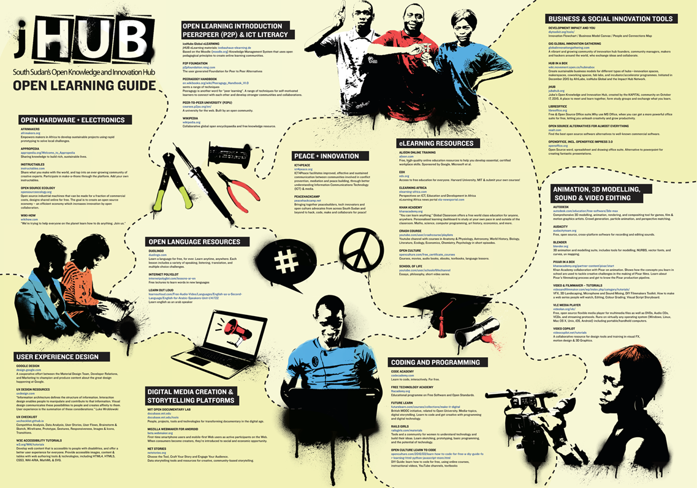
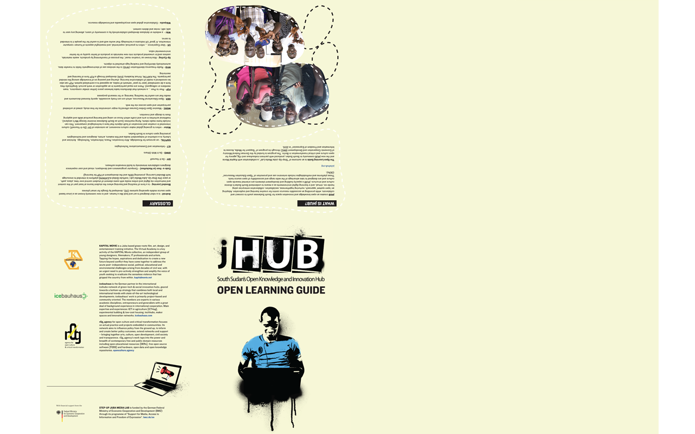

# #ASKnet Open-Learning-Guide

This repository includes the material (texts / graphics / Source file / pdf) of the #ASKnet __Open Learning Guide__ poster .

More about [#ASKnet](https://www.weareasknet.org/) here.

## Design Description

# **Color scheme + Hex Color Codes:**

###  front page:

*  Top left corner (pink): #F38BAF
*  Top right Corner (turqouise): #7CCFDD
*  Bottom left corner (blue): #519DD0
*  Bottom right corner (green) : #B5D44D

###  back page
    Same as back with addition of a yellow square:

*  Top left corner example #1 phone stand (blue): #519DD0
*  Top Right Corner example #2 LED light (pink): #F38BAF
*  Bottom right corner, example #3 Solar Charger (Turqouise): #7CCFDD
*  Bottom left corner with Jhub logo, title page (green): #B5D44D
*  Bottom left corner with partner info/credits (yellow): #F0C539

### graphics + font colors (black and white)

*  Fonts:
*  graphics: outline sketches are white and the steps in each corner.

# **Fonts used:**

* **Title:**  Knockout HTF51 Middleweight   [Download Font](https://copyfonts.com/fonts/knockout-htf51-middleweight.html)
* **Body Text:**  Knockout HTF31-JuniorMiddlewt   [Download Font](https://copyfonts.com/download/knockout-htf31-juniormiddlewt.html)
* **words in white back page (in pink top left corner and the word example, the numbers, and Steps, the text in the templates):**  Chalkduster [Download Font](https://www.ffonts.net/Chalkduster.font)
* **Other (unsure where):** Myriad Pro Regular
  [Download Font](https://fontsgeek.com/fonts/Myriad-Pro-Regular)

# **Text:**

You can acess the raw text files from the text folder [here](#)

* [Front Text](text/OHG-front-FINAL-TEXT.odt)
* [Back Text](text/OHG-back-FINAL-TEXT.odt)

# **Images:**

You can acess the raw images files graphics, icons, and logos from the images folder [here](https://github.com/opencultureagency/Open-Documentation-Guide/tree/master/images)

* [Front images](https://github.com/opencultureagency/Open-Learning-Guide/tree/master/images/front)
* [Back images](https://github.com/opencultureagency/Open-Learning-Guide/tree/master/images/back)
* [Logos](https://github.com/opencultureagency/Open-Learning-Guide/tree/master/images/logos)

# **Source File:**

Adobe Illustrator file:
* [Download Source File](https://cloud.openculture.agency/index.php/s/Dp577rPHnMobQ9m)
PDF Print-Ready file:
* [Download Print-Ready PDF File](https://cloud.openculture.agency/index.php/s/dy2ZZWA39mzPGiS)

# **Editorial Team:**
**Content Creator & Editor**

Design:   
Assembled & Edited by: 
Timm Wille [Github](https://github.com/timmwille/)

## Partners and Founders

The Open Learning Guide is an outcome of "Step Juba Media Lab",
a collaboration with Kapital Movie and the new jHUB community in South Sudan,
produced with partners icebauhaus and r0g_agency for open culture and critical transformation in Berlin.
The program is funded by the German Federal Ministry of International Cooperation and Development (BMZ) through its programme of “Support for Media,
Access to Information and Freedom of Expression” in 2015.

| r0g Agency |      ASKnet      |  BMZ |
|----------|:-------------:|------:|
| | |  |
| [Official Website](https://openculture.agency/) | [Official Website](https://github.com/ASKnet-Open-Training) | [Official Website](https://www.bmz.de/en/) |

## License
[CC-BY-SA 4.0](LICENSE.md) 2017

Providing an accessible resource centre for creative learning and exploration.

Open Learning Guide is free and open for use, modification and sharing by anyone!

Corrections and suggestions for amendments are also very welcome!
